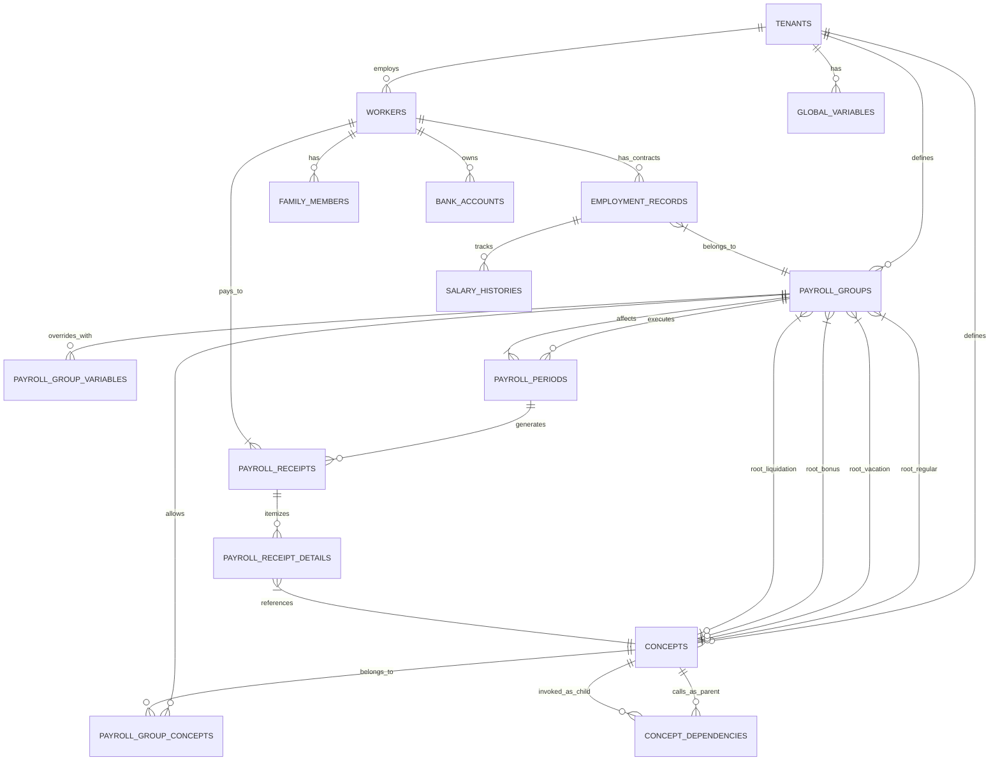

# Diccionario de Datos: Motor de Nómina Estratégico

Este documento detalla exhaustivamente las tablas de base de datos que rigen el comportamiento del motor de nómina para soportar: **Múltiples Empresas (Tenants), Contratos Colectivos (Convenios), Variables Constantes (Vía B), y el Árbol de Ejecución de Conceptos (Fase 5)**.

## Diagrama Entidad-Relación (ERD)

---

## 1. Contexto de Agrupación (A quién se le paga)

*   **`PayrollGroup` (Convenio / Sindicato / Contrato Colectivo)**
    *   `id`: UUID (PK)
    *   `tenantId`: UUID (FK) -> Dueño de la empresa
    *   `name`: Varchar(100) -> Ej: "Empleados Administrativos", "Obreros Fijos".
    *   **Conceptos Maestros de Ejecución (Puntos de Entrada)**:
        *   `rootRegularConceptId`: UUID (Opcional) -> FK. Concepto que arranca la nómina Semanal/Quincenal.
        *   `rootVacationConceptId`: UUID (Opcional) -> FK. Concepto que arranca la nómina de Vacaciones.
        *   `rootBonusConceptId`: UUID (Opcional) -> FK. Concepto para Utilidades/Bonos.
        *   `rootLiquidationConceptId`: UUID (Opcional) -> FK. Concepto para Arreglos Finales.

---

## 2. Variables y Constantes Matemáticas

Para evitar reescribir fórmulas cuando cambia una ley, se usan variables (Ej: `SUELDO_MINIMO`). Siguen un principio de exclusión: Si el Empleado tiene una asignada por Convenio, **usa esa e ignora la Global**.

*   **`GlobalVariable` (Parámetros de la Empresa/País)**
    *   `id`, `tenantId`, `name`.
    *   `code`: Varchar(50) -> Código exacto a usar en fórmulas (ej: `MINIMUM_WAGE`, `TAX_UNIT`).
    *   `value`: Decimal -> El valor numérico (Ej: `130.00`).
    *   `validFrom` / `validTo`: Temporalidad de la variable (Para recálculos en el pasado).

*   **`PayrollGroupVariable` (Constantes o Beneficios de Convenio)**
    *   `id`: UUID
    *   `payrollGroupId`: UUID (FK)
    *   `code`, `name`, `value`, `validFrom`, `validTo` -> Idéntica a la global, pero pertenece estrictamente al Convenio. Ej: Un "Bono Nocturno" vale 30% globalmente, pero para Obreros vale 40%. La variable `PORC_NOCTURNO` en el Convenio Obreros, sobrescribirá la Global.

*   **`WorkerFixedConcept` (Asignaciones Fijas / Novedades del Trabajador)**
    *   `id`: UUID (PK)
    *   `employmentRecordId`: UUID (FK) -> Trabajador al que se le asigna.
    *   `conceptId`: UUID (FK) -> Concepto a pagar (Ej: "Bono Especial").
    *   `amount`: Decimal -> Monto fijo a pagar (Ej: `2000.00`).
    *   `currency`: Varchar(10) -> Moneda del concepto (Ej: `USD`, `VES`).
    *   `validFrom` / `validTo`: Vigencia de la asignación (si `validTo` es nulo, es permanente).

---

## 3. El Catálogo de Cálculos (Qué se paga y Cómo calcularlo)

Estas tablas son el "cerebro" legal. Nos permiten decir: *"El bono nocturno es Asignación, pero es **Bonificable/Salarial** así que debe sumar para las Utilidades"*.

*   **`Concept` (Catálogo Maestro de Conceptos)**
    *   `id`: UUID (PK)
    *   `tenantId`: UUID (FK)
    *   `code`: Varchar(50) -> Código interno del sistema de nómina (Ej: `1001_SUELDO`).
    *   `name`: Varchar(150) -> Nombre corto (Ej: "Sueldo Básico").
    *   **`description`**: Text -> Explicación funcional o legal de cuándo aplica este concepto.
    *   **`accountingCode`**: Varchar(50) -> Código de la cuenta contable mayor (Ej: `5.1.1.01.001 - Sueldos y Salarios`). *Vital para generar la póliza contable a futuro.*
    *   **`accountingOperation`**: Enum -> `DEBIT` (Debe) o `CREDIT` (Haber). Indica de qué lado del asiento contable registrará el total del concepto.
    *   `type`: Enum -> `EARNING` (Asignación), `DEDUCTION` (Deducción), `EMPLOYER_CONTRIBUTION` (Aporte Patronal).
    *   **`isSalaryIncidence`**: Boolean -> Si es `true`, este monto es "Bonificable/Salarial" (Suma para base de utilidades/vacaciones).
    *   **`isTaxable`**: Boolean -> Si suma para la base de retención de impuestos.
    *   **Fórmulas Separadas (Factor x Rata = Monto)**:
        *   `formulaFactor`: Text (Opcional) -> Evalúa la cantidad (ej. `worked_days` o `0`).
    *   `formulaAmount`: Text -> Fórmula de respaldo para montos planos o impuestos complejos. Si existen las 3, `Monto = Factor * Rate`.
    *   `condition`: Text -> Condición lógica para ejectuar la fórmula (ej. `worked_days > 0`).

*   **`ConceptDependency` (El Árbol de Ejecución - Nombramiento Dinámico)**
    *   Esta tabla sustituye el modelo donde una nómina calculaba *todos* los conceptos de un Convenio simultáneamente. Define cómo un concepto "lama" secuencialmente a otros.
    *   `id`: UUID
    *   `parentConceptId`: UUID (FK) -> El Concepto Padre (Ej: "Nómina Regular").
    *   `childConceptId`: UUID (FK) -> El Concepto a ejecutar (Ej: "Sueldo Base").
    *   `executionSequence`: Integer -> Orden en el que el Padre llama al Hijo (e.j., el Hijo Secuencia 10 se llamará antes que el Secuencia 20).

*   **`PayrollGroupConcept` (Vinculación: Concepto ↔ Convenio)**
    *   Tabla puente que expone visualmente qué Conceptos están habilitados/visibles legalmente para qué Convenios (sirve como catálogo de seguridad transaccional, aunque la ejecución final la rijan los Conceptos Maestros).

---

## 4. El Período (Cuándo se paga y Bajo qué reglas)

Esta es la clave para manejar nóminas regulares vs. Nóminas Especiales de cobro único.

*   **`PayrollPeriod` (La Nómina Instanciada)**
    *   `id`: UUID (PK)
    *   `tenantId`: UUID (FK)
    *   `payrollGroupId`: UUID (FK) -> A qué convenio afecta la corrida de esta nómina.
    *   `name`: Varchar(150) -> Ej: "1era Quincena Febrero", "Utilidades 2026", "Liquidación Empleado X".
    *   **`type`**: Enum -> Define el punto de entrada (Root Concept) que ejecutará el motor AST:
        *   `REGULAR`: Buscará el `rootRegularConceptId` del Convenio.
        *   `VACATION`: Buscará el `rootVacationConceptId`.
        *   `PROFIT_SHARING`: (Utilidades/Aguinaldos). Buscará el `rootBonusConceptId`.
        *   `SETTLEMENT`: (Liquidación/Finiquito). Buscará el `rootLiquidationConceptId`.
        *   `SPECIAL`: (Nóminas especiales o complementarias en divisas).
    *   `startDate` / `endDate`: Date -> Fechas fiscales y de asistencia aplicables a la nómina.
    *   **`linkedAttendancePeriodId`**: UUID (FK, Opcional) -> Permite a nóminas especiales leer los días trabajados (`AttendanceSummary`) desde otra nómina regular para evitar doble carga de asistencia.
    *   `status`: Enum -> `DRAFT` (Borrador Editable), `PRE_CALCULATED` (Montos simulados listos para revisión), `CLOSED` (Cerrado/Pagado/Intocable en Contabilidad).

---

## 5. Recibos e Historiales (Los Resultados Inmutables)

Una vez que el motor corre la nómina `REGULAR` de la primera quincena, genera y sella esta data:

*   **`PayrollReceipt` (El Recibo Físico/Virtual)**
    *   `id`: UUID (PK)
    *   `payrollPeriodId`: UUID (FK) -> Relación a la Nómina instanciada.
    *   `workerId`: UUID (FK) -> Relación al Empleado evaluado.
    *   **`totalSalaryEarnings`**: Decimal -> Sumatoria de asignaciones BONIFICABLES (Base para prestaciones y utilidades).
    *   **`totalNonSalaryEarnings`**: Decimal -> Sumatoria de asignaciones NO BONIFICABLES (Viáticos, reintegros).
    *   `totalEarnings`: Decimal -> Ingresos Brutos Totales (Suma de los dos anteriores).
    *   `totalDeductions`: Decimal -> Sumatoria de retenciones.
    *   `netPay`: Decimal -> Neto a pagar (Depositado al banco).
    *   **`employerContributions`**: Decimal -> Sumatoria de los aportes patronales (Esto no va al neto a pagar, pero se graba para calcular contablemente el "Costo Real" del empleado en ese recibo).

*   **`PayrollReceiptDetail` (Las líneas de cobro del recibo)**
    *   `id`: UUID (PK)
    *   `payrollReceiptId`: UUID (FK)
    *   `conceptId`: UUID (FK) -> Qué concepto se evaluó.
    *   `conceptNameSnapshot`: Varchar(150) -> Foto del nombre ("Hora Extra Nocturna").
    *   **Variables Resultantes de Ejecución:**
        *   **`factor`**: Decimal -> Ejemplo: `3.5` (Horas trabajadas).
        *   **`rate`**: Decimal -> Ejemplo: `$12.00` (Valor de la hora + recargo).
        *   **`amount`**: Decimal -> El monto exacto final resultante (ej: `$42.00`).
    *   `typeSnapshot`: Enum (`EARNING` | `DEDUCTION`) -> Para totalizar matemáticamente.

---

### Análisis de Escenarios con esta Estructura

### Análisis de la Arquitectura de "Llamadas de Conceptos"

1.  **"Voy a ejecutar una Nómina Regular del Convenio Administrativo"**
    *   El usuario crea la nómina tipo `REGULAR`. Selecciona fechas 01 al 15.
    *   El sistema carga el Convenio Administrativo, busca su propiedad `rootRegularConceptId`. (Digamos que es el Concepto Interno: `INICIO_QUINCENAL`).
    *   El sistema busca en `ConceptDependency` todos los hijos cuyo padre sea `INICIO_QUINCENAL`. Consigue `SUELDO`, `HORAS_EXTRAS`, `SSO`, y `FAOV`, ordenados por `executionSequence`.
    *   El AST corre matemáticamente a esos 4 hijos en orden. Emitiendo a la RAM de memoria los resultados `fact_`, `rata_` y `monto_` por cada paso para encadenar sumatorias de los impuestos.

2.  **"Necesito liquidar (SETTLEMENT) a un obrero"**
    *   El usuario crea una nómina tipo `SETTLEMENT`.
    *   El sistema levanta el `rootLiquidationConceptId` del Convenio Obreros (que podría apuntar al concepto `INICIO_RETIRO_OBREROS`).
    *   Este concepto principal NO llama a `SUELDO` ni a `BONOS`. Llama únicamente a los Sub-Conceptos `INDEMNIZACION_ANTIGUEDAD`, `VACACIONES_FRACCIONADAS`, `UTILIDADES_FRACCIONADAS`. 
    *   El pago es completamente estanco y automático. 

3.  **Encapsulamiento del Analista en Seguridad**
    *   El Analista de Nómina que atiende al sindicato Obrero, solo tiene acceso al `PayrollGroup` (Convenio) "Obrero". La Interfaz le mostrará única y exclusivamente las Nóminas atadas a ese identificador y las Leyes (Global Variables sobrescritas) de ese sindicato.
